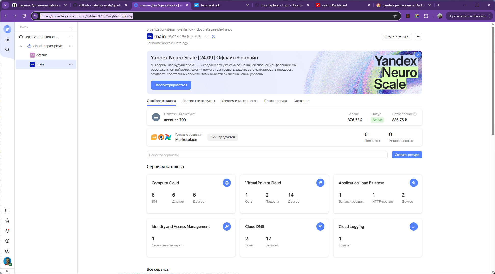
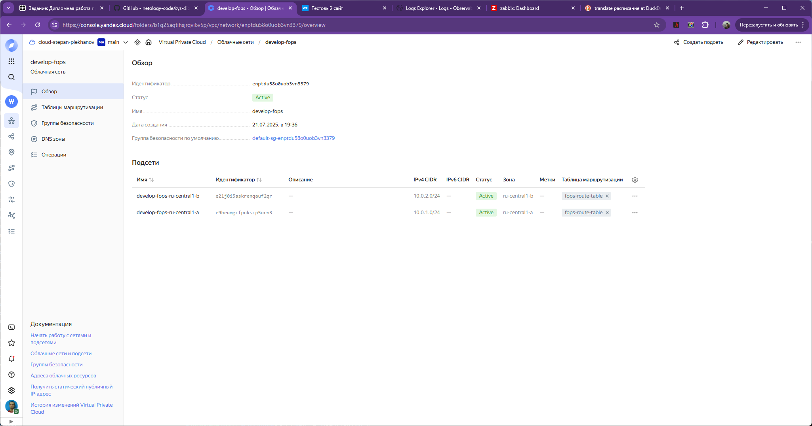
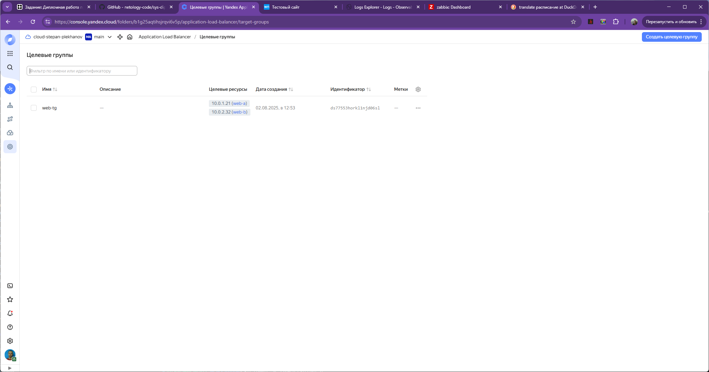
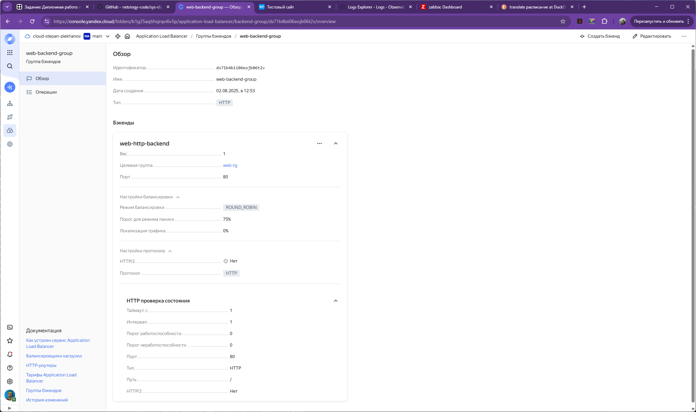
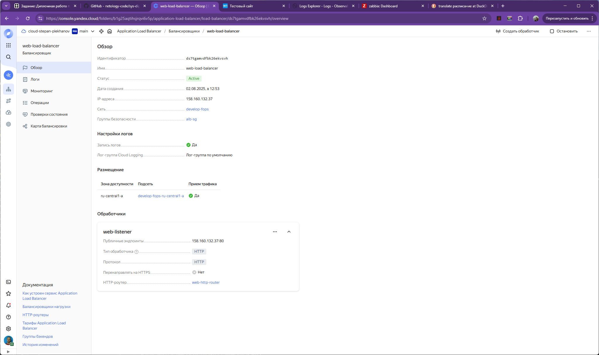

# Дипломная работа по профессии «Системный администратор» - Плеханов С.А.

## Задача
Ключевая задача — разработать отказоустойчивую инфраструктуру для сайта, включающую мониторинг, сбор логов и резервное копирование основных данных. Инфраструктура должна размещаться в Yandex Cloud и отвечать минимальным стандартам безопасности: запрещается выкладывать токен от облака в git.
## Решение
В рамках решения задачи были использованы механизмы создания инфраструктуры как кода (IaC) Terraform и Ansible. Конфигурация инфраструктуры хранится в файлах network.tf и vms.tf.
В результате была создана следующая структура объектов в YandexCloud:

Инфраструктура включает 6 виртуальных машин:

Так же создана одна облачная сеть с двумя подсетями в разных зонах:

На двух виртуальных машинах, размещенных в разных подсетях размещен тестовый сайт:

Виртуальные машины объединены в целевую группу:

Так же создана бэкенд группа, которая ссылается на целевую группу:

И HTTP-роутер:

Создан балансировщик нагрузки, размещенный в публичном сегменте и имеющий внешний адрес для доступа пользователей сайта:

Для мониторинга состояния виртуальных машин создан Zabbix сервер, а на всех ВМ установлены агенты, которые передают информацию на сервер:

Для контроля состояния сайта организован сбор журналов на сервер Elasticsearch через агенты Filebeat, установленные на веб-серверах. Сервер расположен в приватном сегменте и не имеет внешнего адреса. Для визуализации журналов в публичном сегменте размещен сервер Kibana:

В целях организации резервного копирования созданы снимки дисков всех виртуальных машин:

А так же расписание, по которому снимки создаются ежедневно в 23:00 и хранятся 7 дней:

